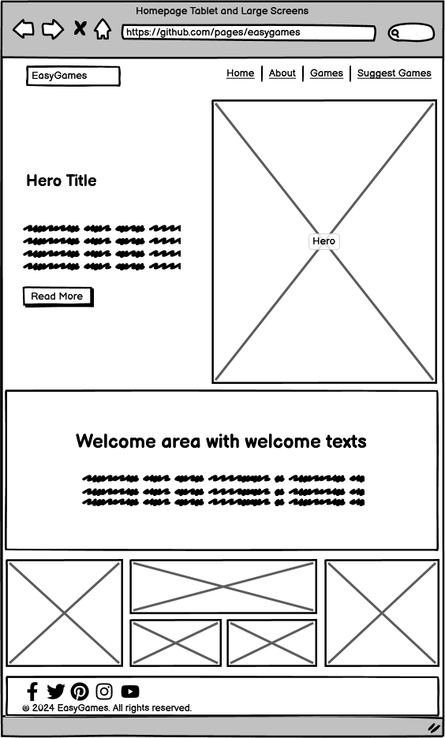
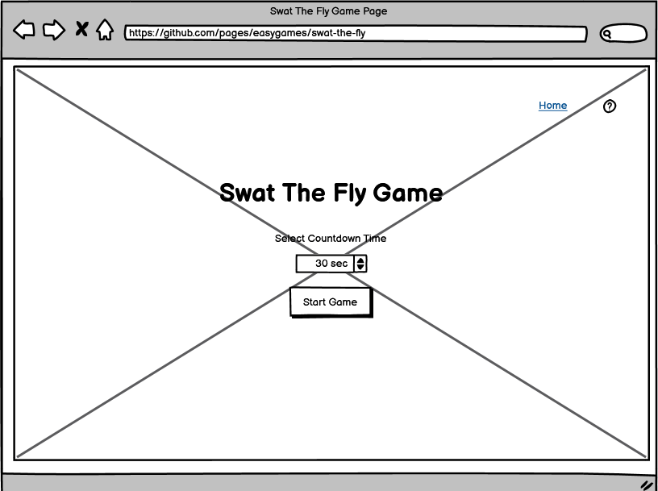
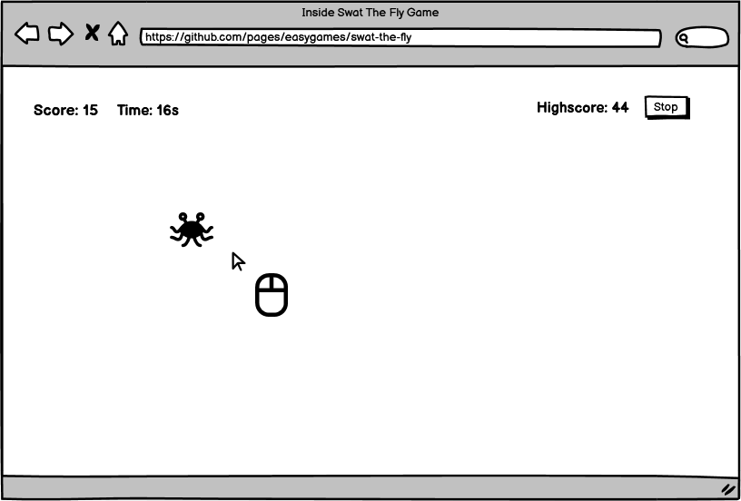

# Easygames

*A collection of simple, enjoyable browser-based games designed to entertain and challenge players of all ages.*

## Table of Contents

- [Overview](#overview)
- [User Experience (UX)](#user-experience-ux)
  - [User Stories](#user-stories)
  - [Design](#design)
    - [Color Scheme](#color-scheme)
    - [Typography](#typography)
    - [Imagery](#imagery)
  - [Wireframes](#wireframes)
- [Game Documentation](#game-documentation)
  - [Swat the Fly](#swat-the-fly)
- [Features](#features)
  - [Existing Features](#existing-features)
  - [Features Left to Implement](#features-left-to-implement)
- [Technologies Used](#technologies-used)
- [Testing](#testing)
  - [Code Validation](#code-validation)
  - [Functionality Testing](#functionality-testing)
  - [Browser Compatibility](#browser-compatibility)
  - [Known Bugs](#known-bugs)
- [Deployment](#deployment)
- [Credits](#credits)
  - [Content](#content)
  - [Media](#media)
- [Acknowledgements](#acknowledgements)

## Overview

**Easygames** is a platform offering a variety of lightweight, fun-filled games that you can play directly in your web browser. Designed for quick entertainment, each game on Easygames is easy to pick up and play, making it perfect for short breaks or casual gaming sessions. Whether you're looking to test your reflexes, challenge your high score, or simply enjoy a few minutes of distraction, Easygames provides an accessible and enjoyable gaming experience for everyone.

The current highlight of Easygames is **Swat the Fly**—a fast-paced game where players aim to swat flies as they randomly appear on the screen before the time runs out.

## User Experience (UX)

### User Stories

- **As a player**, I want to access a variety of simple, fun games from one platform.
- **As a player**, I want to easily navigate between different games on the platform.
- **As a player**, I want each game to be intuitive and easy to play without needing complex instructions.

### Design

#### Color Scheme

- The website uses a consistent color scheme that is both playful and visually appealing, ensuring that each game is distinct yet part of the larger Easygames collection.

#### Typography

- I have built the website with Catamaran font from Google Fonts. All font weight was applied on the website.

#### Imagery

- Each game within Easygames uses unique imagery that fits its theme, enhancing the overall user experience. 

### Wireframes

Wireframes were created with Balsamiq to plan the layout of the Easygames platform and individual game pages.

- #### Home Page Large Screens

- #### Home Page Mobile Screens

- #### Swat The Fly Homepage

- #### Swat The Fly Gameplay

## Game Documentation

### Swat the Fly

**Swat the Fly** is a quick-reflex game where players must swat as many flies as possible within a set time limit. The game is simple to play but challenging to master, making it a perfect addition to the Easygames collection.

#### User Stories

- **As a player**, I want to understand the game mechanics quickly so I can start playing right away.
- **As a player**, I want to hear a satisfying sound effect when I successfully swat a fly to enhance the experience.
- **As a player**, I want to be able to choose the game duration to match my desired level of challenge.
- **As a player**, I want the game to track my highest score so I can try to beat it in future sessions.
- **As a player**, I want the game to be visually appealing and responsive to create an enjoyable experience.

#### Features

- **Random Fly Movement**: Flies appear and move randomly across the screen, requiring quick reflexes to swat.
- **Custom Cursor**: The mouse cursor is replaced with a swatter image to enhance the gameplay experience.
- **Sound Effects**: A satisfying swatting sound plays each time a fly is hit, with background music adding to the immersion.
- **Customizable Timer**: Players can choose the countdown time before starting the game.
- **High Score Tracking**: The highest score is temporarily saved, allowing players to try and beat their previous best.

#### How to Play

1. Start the game by selecting a countdown timer.
2. Flies will appear randomly on the screen.
3. Use the swatter cursor to click on the flies as quickly as possible.
4. The game ends when the timer runs out, and your score is compared against the high score.

## Features

### Existing Features

- **Swat the Fly**: A fast-paced game with customizable settings and high score tracking.
- **Sound Effects and Music**: Engaging audio elements that enhance the user experience.
- **Customizable Settings**: Allow players to set their own game difficulty and timer.

### Features Left to Implement

- **New Games**: Additional games to be added to the Easygames collection.
- **Global Leaderboard**: Compare scores with other players worldwide.
- **Mobile Responsiveness**: Further enhancements to ensure all games are fully responsive across devices.

## Technologies Used

- **HTML5**: Structure of the games and platform.
- **CSS3**: Styling and responsive design.
- **JavaScript (ES6)**: Core game logic and interactivity.
- **GitHub Pages**: Deployment of the platform.

## Testing

### Code Validation

- Coming soon

### Functionality Testing

- Testing coming soon.

### Browser Compatibility

- Not yet tested

### Known Bugs

- Will update bugs as I continue coding

## Deployment

Will deploy on Github pages
